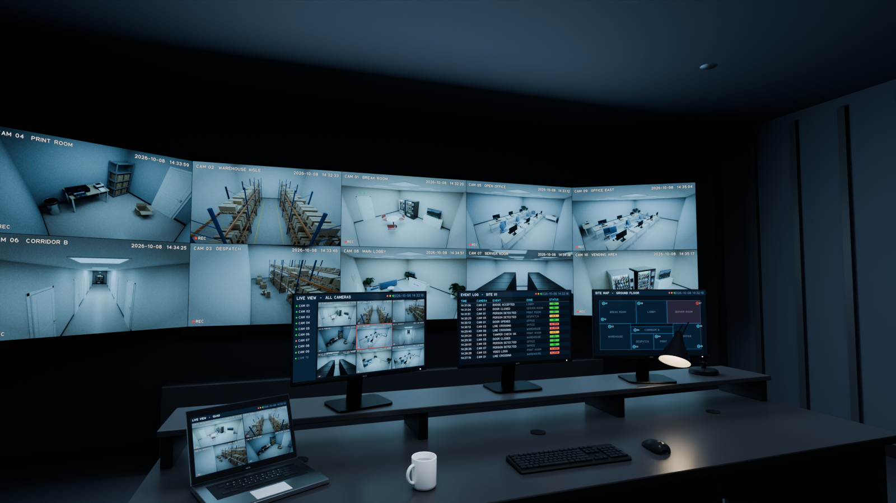
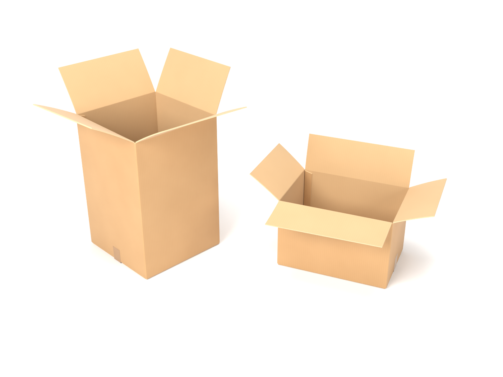
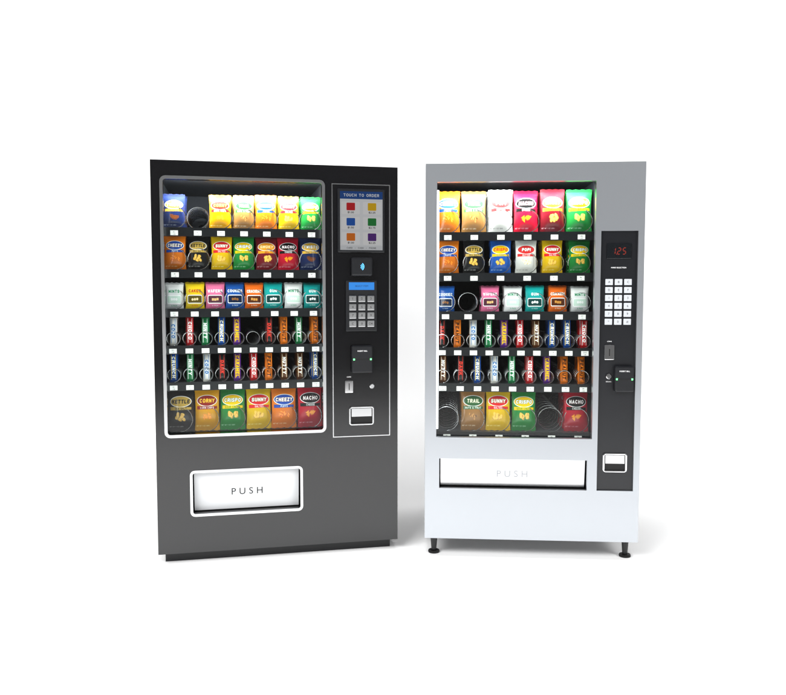
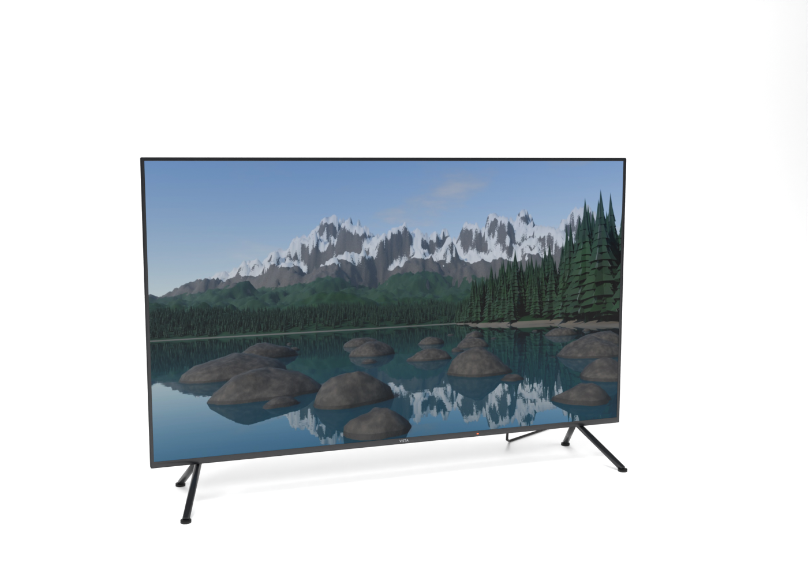
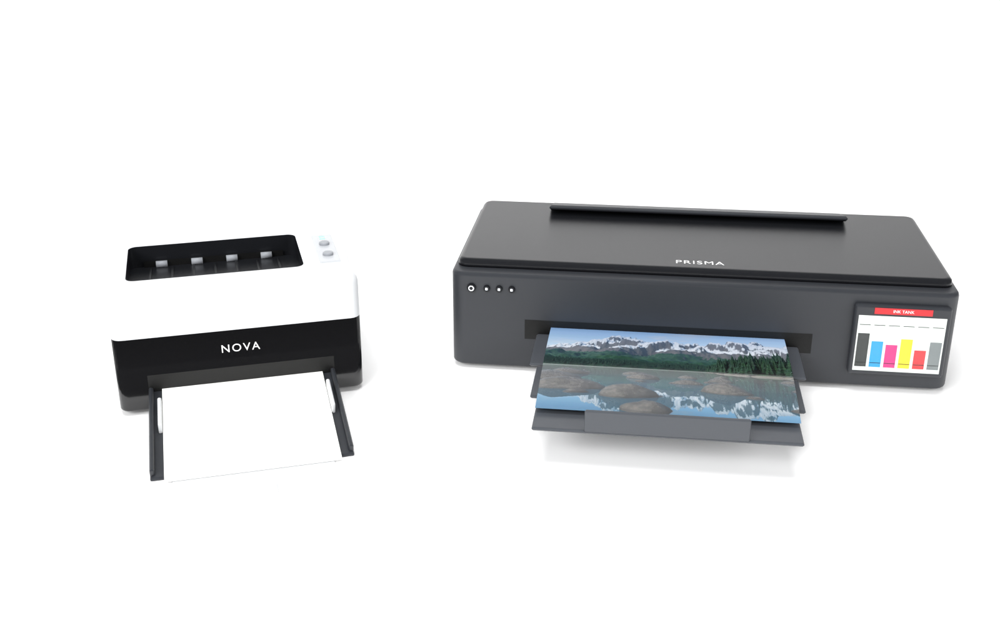
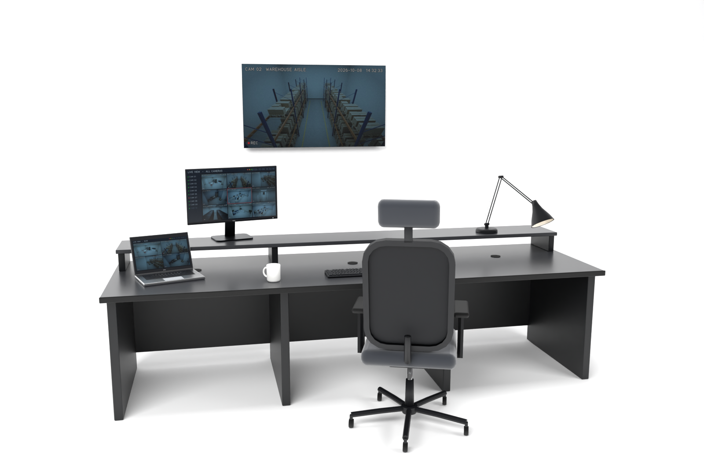
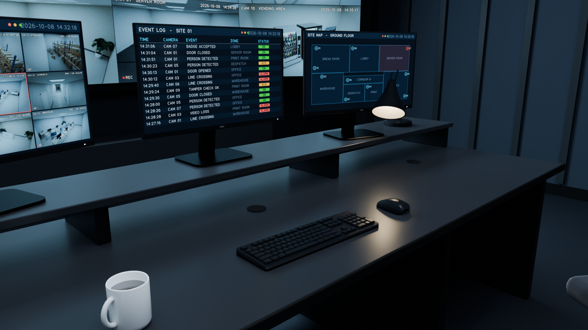

# Procedural Blender Models

Detailed, fully procedural Blender models, generated by Python from reference photos.

| File | Contents |
|---|---|
| [`props.blend`](#props-boxes-vending-machines-tv-printers-control-room) | open cardboard boxes, two snack vending machines, a 50" TV, two printers and a security control room |
| [`bathroom.blend`](#bathroom) | a residential bathroom and a public washroom |

Both open in **Blender 4.2 LTS or newer** and render with **Cycles**.

---

## Props: boxes, vending machines, TV, printers, control room

`props.blend` holds a model of everything in the five reference photos. It has three scenes:

| Scene | What it is |
|---|---|
| **Prop Library** | Every model once, on a white photo sweep, with product-shot cameras framed like the reference photos. Each model is an **asset-marked collection**, so you can drag it in from the Asset Browser (*Current File*). |
| **Security Control Room** | The control room from the third photo: a 10-panel video wall, an operator console with three monitors, a laptop, keyboard, mouse, desk lamp, coffee mug and an operator chair. |
| **CCTV Sets** | The rooms the control room watches: break room, warehouse, print room, office, corridor, server room and lobby. They are furnished with the other models (the vending machines in the break room, the printers in the print room, the boxes in the warehouse, the TV in the lobby). Their ten CCTV cameras render the video-wall feeds. |



| | |
|---|---|
|  |  |
|  |  |
|  |  |

More renders, including the video wall close-up and the set dressing, are in [`renders/`](renders)
(files starting with `props_`). The ten CCTV feeds are in [`props_gen/images/`](props_gen/images).

### Opening it

1. Open `props.blend` in **Blender 4.2 LTS or newer** (tested on 4.2.0 and 5.0.1) and pick a scene
   from the scene selector.
2. Every scene has its own cameras:
   - *Product - …* in the Prop Library;
   - *Control Room - …*;
   - *CCTV 01 … 10*.
3. Select a camera and press <kbd>Ctrl</kbd>+<kbd>Numpad 0</kbd> to look through it.
4. Render with **Cycles**. Lights, render settings and colour management are already set: the
   *Standard* view for the white studio, and AgX for the control room and CCTV rooms.

The rooms place **collection instances** of the library models. If you edit a model in the
*Prop Library*, every copy updates. In the studio, each product group has its own light rig.
`build_props.py --render` switches the other rigs off for each product shot.

### One colour per object

Every object has **exactly one material**, so every part can be recoloured on its own, and the
models carry over to engines where one part has one colour. A vending machine, for example, is a
group of objects such as *Cabinet*, *Door*, *Glass*, *Spirals*, *Keypad buttons*,
*Keypad legends*, *Price labels* and *Price label text*. Printed text (keypad legends, price labels,
logos, "PUSH") is real geometry in its own object, not part of a texture.

Material names say what the colour is (*Plastic Black Gloss*, *Silver Powder Coat*,
*Kraft Outer* …). Parts that share a colour share a material: edit the material to recolour all of
them, or give one object its own copy (*Material Properties → New Material*) to change just that part.

Only printed artwork uses images. These parts are still one object with one material each:
- the snack packaging;
- the TV picture and the printed photo;
- the monitor and video-wall screens.

### What's modelled

- **Cardboard boxes** (photo 1): tall square box and regular shipping box, open.
  - The board has real thickness. Outer liner, inner liner and cut edges are separate objects.
  - Walls fold round rounded corners, and each flap is joined by a bent score line.
  - Flaps have a slight curl and warp. There's a glued manufacturer's joint inside one corner, and
    the bottom is taped shut.
  - The kraft material shows the flutes under the liner.
  - A closed, taped box is included for stacking.
  - Flap angles are parameters of `cardboard_box()`.
- **Vending machines** (photo 2):
  - **Classic silver:** spiral machine on levelling legs, with a red 7-segment price display,
    keypad, coin slot, bill acceptor, coin return and a brushed-steel PUSH door.
  - **Modern black:** glass-front machine with an aluminium window trim, a touch screen showing a
    menu, a contactless card reader, an LCD keypad, a bill acceptor and a light-grey delivery flap.
  - **Both:** six trays of wire spirals with motors, price channels with labels (A1, B2 …), an
    interior light, and about 170 snack packs.
  - **Snack packs:** chip bags, candy bars and cookie packs. Each is a puffy pack with crimped
    seals, and the artwork uses made-up brands.
- **50" TV** (photo 4):
  - thin bezel with logo and standby LED, back cover with electronics box, vents, VESA holes and
    connectors;
  - splayed V feet with rubber pads, and a power cord;
  - the screen shows a mountain-lake landscape.
- **Landscape picture:** rendered from a real 3D scene (terrain, about 11,000 pines, boulders, lake
  and sky), not painted. The photo printer prints the same picture.
- **Printers** (photo 5):
  - **Compact mono laser:** grey top cover with a sunken output bay, rollers and ribs; status panel
    with buttons and LEDs; glossy black lower body; manual feed tray folded open with paper and guides.
  - **A3+ ink-tank photo printer:** front control buttons, pulled-out output tray, and a photo
    halfway out. The front tank unit shows six coloured inks at different levels behind a window.
- **Security control room** (photo 3):
  - **Video wall:** 3 × 2 panels of 55" ultra-narrow-bezel displays, plus a 1 × 2 wing on each side
    angled towards the operator.
  - **Operator console:** monitor shelf with three 27" monitors showing a camera grid, an event log
    and a site map.
  - **On the desk:** a laptop on a quad view, a full-size keyboard with all 104 legends, a mouse, a
    spring-balanced architect lamp (a real light) and a mug of coffee.
  - **Room:** operator chair, acoustic walls with battens, and cool downlights.
- **Set dressing** for the CCTV rooms: round table, stacking and office chairs, office desks,
  reception desk, sofa, pallets, pallet racking, shelving, server racks with status LEDs and an
  exit sign. The palm, door, LED panels and bin are reused from the bathroom models.

All brands are made up (*NOVA*, *PRISMA*, *VISTA* and the snack names), so the models contain no
real trademarks. To change them:
- edit `LASER_BRAND` and `INKJET_BRAND` in `props_gen/printers.py`;
- edit `BRAND` in `props_gen/electronics.py`;
- edit the design tables in `props_gen/snacks.py`.

### The screens

Monitors, the video wall and the laptop share one material. Its image, the **Screens Atlas**, holds
16 pictures in a 4 × 4 grid:
- the ten CCTV feeds, graded to look like security footage: cool tint, grain, vignette, camera
  name, timestamp and REC;
- a 3 × 3 and a 2 × 2 camera grid;
- an event log, a site map, a status dashboard and a *no signal* screen.

Each placed screen picks its picture with two custom properties on the instance:
- `scr_min` (*Object Properties → Custom Properties*);
- `scr_size`.

`facility.screen_tile(n)` gives the values for picture *n*. Without them, a screen falls back to the
default picture stored on the screen object itself, and failing that shows the whole atlas.

The feeds and the landscape are rendered once and kept in `props_gen/images/`, so a normal build
takes about 10 seconds. Run `--refresh-screens` after changing a model to re-render them (about
20 minutes on a 4-core CPU).

### Regenerating / modifying

```bash
# with Blender
blender --background --python build_props.py -- --render

# or with the standalone bpy module (pip install bpy)
python build_props.py --render --samples 128
```

| Option | Meaning |
|---|---|
| `--output PATH` | `.blend` file to write (default `props.blend`) |
| `--render` | render every product and control-room camera to `renders/` |
| `--cameras tv,printers` | only render cameras whose name contains these words |
| `--samples N` | Cycles samples (default 256) |
| `--scale PCT` | resolution percentage, e.g. `25` for quick previews |
| `--refresh-screens` | re-render the landscape picture and the ten CCTV feeds |
| `--no-feeds` | skip rendering missing CCTV feeds (screens show *no signal*) |

| File | Contents |
|---|---|
| `build_props.py` | entry point: builds the three scenes, saves and renders |
| `props_gen/mesh.py` | UV-aware mesh builder, single-colour `Parts`, real-geometry text |
| `props_gen/materials.py` | the props materials (registered in the bathroom material library) |
| `props_gen/textures.py` | numpy canvas with a vector stroke font, used for all printed artwork |
| `props_gen/boxes.py` | cardboard boxes |
| `props_gen/snacks.py` | snack artwork atlas and pack shapes |
| `props_gen/vending.py` | both vending machines |
| `props_gen/electronics.py` | TV, monitor, video-wall display, laptop, keyboard, mouse |
| `props_gen/printers.py` | laser and ink-tank printers |
| `props_gen/office.py` | lamp, mug, console desk, chairs and set dressing |
| `props_gen/landscape.py` | the 3D landscape behind the TV picture |
| `props_gen/facility.py` | the CCTV rooms and screen-atlas addressing |
| `props_gen/screens.py` | CCTV feed rendering, footage grade and the monitor UIs |
| `props_gen/scenes.py` | prop library, studio, control room and render settings |
| `props_gen/studio.py` | photo-studio sweep, lights and cameras |

The props reuse the bathroom's mesh toolkit (`bathroom_gen/geo.py`) and material library.

---

## Bathroom

A detailed, fully procedural bathroom model for Blender, generated by Python.
`bathroom.blend` contains three scenes:

| Scene | What it is |
|---|---|
| **Residential Bathroom** | Sage-green family bathroom modelled on the first reference photo: pedestal basin, close-coupled toilet, L-shaped shower bath with brass thermostatic shower and glass screen, LED mirror, tiled ledge and niche, marble floor. |
| **Public Washroom** | Lilac commercial washroom modelled on the second reference photo: 5-bowl vanity with sensor taps and soap dispensers, mirror wall, four oak-door WC cubicles, urinals, hand dryers and a suspended LED ceiling. |
| **Fixture Library** | Every product in the file, shown once as a catalogue. Each one is an **asset-marked collection**: you can drag it from the Asset Browser (*Current File*) into any scene. |


More renders, including close-ups and the fixture catalogue, are in [`renders/`](renders).

### Opening it

1. Open `bathroom.blend` in **Blender 4.2 LTS or newer** (tested on 4.2.0 and 5.0.1).
2. Pick a scene from the scene selector at the top right of the window.
3. Each scene has several cameras in its *Lighting & Cameras* collection. Select one and press
   <kbd>Ctrl</kbd>+<kbd>Numpad 0</kbd> to look through it.
4. Render with **Cycles**. Render settings, lights and colour management (AgX) are already set.
   Material Preview in the viewport (EEVEE) works too.

The rooms place **collection instances** of the library fixtures. If you edit a fixture in the
*Fixture Library* scene, every copy in both rooms updates. To edit a single copy, select it and use
*Object → Apply → Make Instances Real*.

### What's modelled

Everything is real geometry. There are no image-based stand-ins, apart from the generated art print.

**Residential bathroom**
- **Close-coupled toilet:** square-profile pan with a modelled bowl, trap and water surface. Soft-close seat with buffers and hinges, closed lid, cistern with separate lid and a dual-flush button.
- **Pedestal basin:** lofted ceramic bowl with tap deck, overflow ring and click-clack waste, on a full pedestal.
- **Brushed-brass taps:** tall single-lever basin mixer with aerator, and a wall-mounted bath filler with knurled heads.
- **Thermostatic shower kit:** bar valve with knurled controls, wall unions with hex nuts, rigid riser with wall bracket, swan-neck arm, 240 mm rain head with ~130 silicone nozzles, slide holder and handset. The metal hose has a real ribbed surface and ferrules.
- **L-shaped shower bath (1700 mm):** acrylic tub, L-shaped front panel with a recessed plinth, brass waste and overflow.
- **Bath screen:** glass with green polished edges, brass wall channel, edge stiffener and seal.
- **LED mirror:** rounded brushed-brass frame, warm backlight that glows on the wall, touch-sensor icons.
- **Accessories:** toilet-roll holder with roll and hanging sheet, toilet brush, ceramic soap pump, toothbrush tumbler, framed print (artwork generated procedurally), green-glass pump bottle, bottle and jar in the niche.
- **Room fittings:** ladder towel radiator with valves and a draped towel, bath mat, panelled door with lever handle, brass-trim downlights (each a real spot lamp), extractor fan.
- **Plants:** a trailing pothos spilling over the ledge and a kentia palm in a planter.
- **Tiling:** individual 3D tiles, not a texture. Walls use 75 × 300 mm tiles in vertical stack bond, each with glazed chamfered edges, random colour variation and slight lippage. Grout is recessed. The tiling covers a ledge (duct) and a recessed niche, with brushed-brass trims on the exposed edges. The floor uses 600 × 600 mm marble tiles.

**Public washroom**
- **Vanity:** solid-surface counter with five integrated oval bowls, apron and upstand, plus chrome wastes and bottle traps underneath.
- **Taps and soap:** chrome infrared sensor taps, and automatic wall soap dispensers with smoked level windows, nozzle and sensor.
- **Mirror:** full-length frameless mirror with chrome clips.
- **WC cubicles (four):**
  - grey laminate partitions and pilasters
  - oak doors, two of them open
  - aluminium headrail and adjustable chrome legs
  - hinges, pull handles and coat hooks
  - indicator locks: red when engaged, green when vacant
- **Cubicle contents:** wall-hung WCs with seats and water, dual-flush plates on a service duct, jumbo roll dispensers, sanitary bins.
- **Urinals:** two urinals with sensor flush valves and strainers, separated by oak privacy screens.
- **Wall units:** stainless hand dryers, paper-towel dispenser, waste bin with liner.
- **Finishes:**
  - 150 × 150 mm lilac wall tiles
  - 300 × 300 mm speckled floor tiles
  - suspended grid ceiling with 600 × 600 mm LED panels (real area lights)

Geometry at render subdivision levels: about 0.29 M triangles for the residential scene and
0.42 M for the public washroom. There are 48 PBR materials, all procedural apart from the art print.

### Using the models in Roblox

`roblox_export.zip` holds Roblox-ready versions of everything. Unzip it to get:

| File | Contents |
|---|---|
| `roblox/fixtures/*.obj` | each of the 38 fixtures as its own model (toilet, basin, taps, shower, bath, urinal, dryers …) |
| `roblox/rooms/Residential_Bathroom.obj`, `Public_Washroom.obj` | each room fully assembled |
| `roblox/apply_materials.lua` | gives every part its Roblox colour, material, reflectance and transparency |
| `roblox/textures/art_print.png` | image for the framed print |

The export has already been adapted to Roblox:
- **Scale:** sized in studs (1 stud = 0.28 m), with Y pointing up.
- **Triangle limit:** every part is under Roblox's mesh limit (at most 19,000 triangles).
- **Materials:** parts are split per material and named `<part>__<Material>`.
- **Textures:** every part has UVs, so Roblox's textured materials (Wood, Marble, Fabric …) apply properly.

**Importing:**
1. In Roblox Studio open **File → Import 3D** (or the *Import 3D* button on the Home/Avatar tab) and pick an `.obj`. Keep each `.mtl` next to its `.obj`.
2. In the import dialog, leave the scale as studs. The 3 m bathroom should come in about 11 studs wide. Click **Import**.
3. Select the imported model in the Explorer. Then open **View → Command Bar**, paste the contents of `apply_materials.lua` and press <kbd>Enter</kbd>. Every part gets its proper look (glass, brass, chrome, tiles, wood doors …) and is anchored.
4. *(Optional)* To show the artwork in the frame:
   - upload `art_print.png` through the Asset Manager;
   - copy its `rbxassetid://…` id into `ART_PRINT_TEXTURE` at the top of the script;
   - run the script again.

Tips:
- **Lights:** the room ceilings are solid, so add PointLights/SurfaceLights (for example on the `Neon` light parts) or delete the ceiling part. Blender lights don't export.
- **Large room files:** the room files are large because every tile is real geometry. If Studio is slow, import the individual fixtures instead and build the room from Roblox parts.
- **Re-exporting:** regenerate the export after changing the `.blend` with
  `blender --background --python export_roblox.py` (options: `--studs-per-m`, `--max-tris`, `--subdiv`).

### Regenerating / modifying

The `.blend` is produced by the scripts in this repository:

```bash
# with Blender
blender --background --python build_bathroom.py -- --render

# or with the standalone bpy module (pip install bpy)
python build_bathroom.py --render --samples 128
```

| Option | Meaning |
|---|---|
| `--output PATH` | `.blend` file to write (default `bathroom.blend`) |
| `--render` | render every camera to `renders/` |
| `--cameras home,cubicle` | only render cameras whose name contains these words |
| `--samples N` | Cycles samples (default 256) |
| `--scale PCT` | resolution percentage, e.g. `25` for quick previews |

The build takes about 3 seconds. Renders take a few minutes per camera on a CPU.

#### Code layout

| File | Contents |
|---|---|
| `build_bathroom.py` | entry point: creates the scenes, saves, and renders |
| `export_roblox.py` | converts `bathroom.blend` into the Roblox OBJ files + styling script |
| `bathroom_gen/geo.py` | mesh toolkit with no `bpy.ops`: superellipse and rounded-polygon rings, a lofter, lathe, tube and profile sweeps along rotation-minimising frames, fillets, splines, and the 3D tile layer |
| `bathroom_gen/materials.py` | procedural PBR material library (ceramic, brushed brass, glazed tiles, marble, oak laminate, glass, fabric, leaves …) |
| `bathroom_gen/textures.py` | numpy-generated art print, packed into the file |
| `bathroom_gen/fixtures_home.py` | residential fixtures |
| `bathroom_gen/fixtures_public.py` | commercial fixtures, vanity counter and cubicle system |
| `bathroom_gen/plants.py` | pothos and palm generators |
| `bathroom_gen/scenes.py` | fixture library, room shells, tiling layout, lights, cameras and render settings |

All fixtures share one convention: they are modelled with the mounting wall at local `y = 0`, the
front facing `-Y` and dimensions in metres. Changing the numbers in the fixture tables (for example
`PAN_CC`, `BATH_L` or the vanity's `n`/`spacing`) and rebuilding produces new variants.
