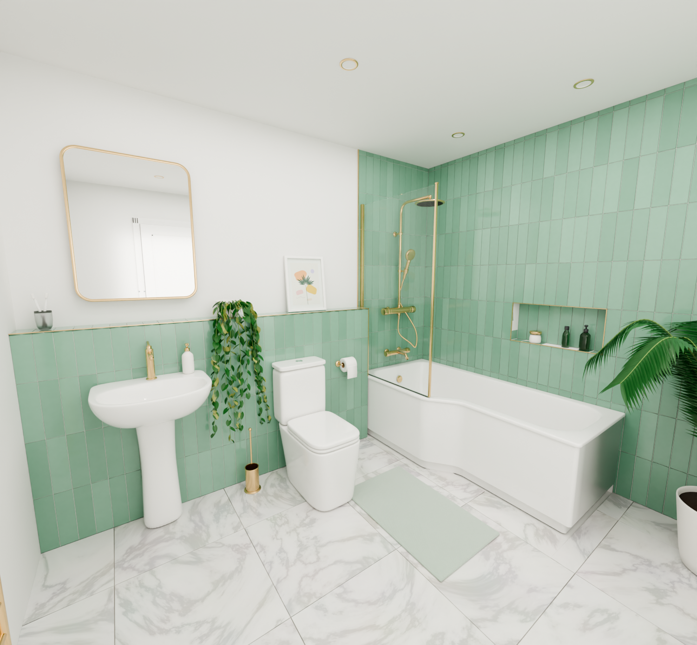
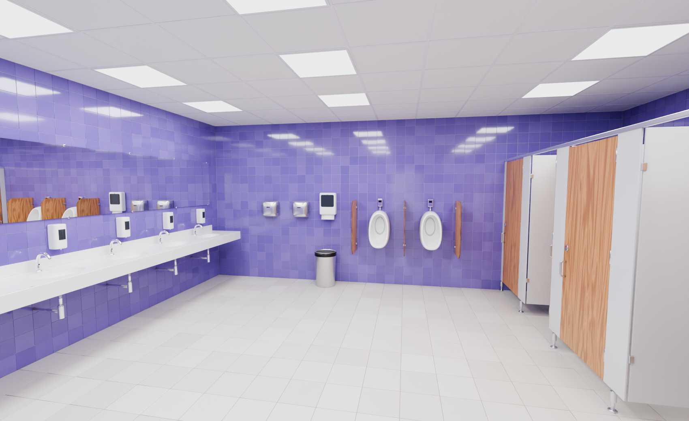

# Procedural Bathroom for Blender

A detailed, fully procedural bathroom model for Blender, generated by Python.
`bathroom.blend` contains three scenes:

| Scene | What it is |
|---|---|
| **Residential Bathroom** | Sage-green family bathroom modelled on the first reference photo: pedestal basin, close-coupled toilet, L-shaped shower bath with brass thermostatic shower and glass screen, LED mirror, tiled ledge and niche, marble floor. |
| **Public Washroom** | Lilac commercial washroom modelled on the second reference photo: 5-bowl vanity with sensor taps and soap dispensers, mirror wall, four oak-door WC cubicles, urinals, hand dryers and a suspended LED ceiling. |
| **Fixture Library** | Every product in the file, shown once as a catalogue. Each one is an **asset-marked collection**: you can drag it from the Asset Browser (*Current File*) into any scene. |




More renders, including close-ups and the fixture catalogue, are in [`renders/`](renders).

## Opening it

1. Open `bathroom.blend` in **Blender 4.2 LTS or newer** (tested on 4.2.0 and 5.0.1).
2. Pick a scene from the scene selector at the top right of the window.
3. Each scene has several cameras in its *Lighting & Cameras* collection. Select one and press
   <kbd>Ctrl</kbd>+<kbd>Numpad 0</kbd> to look through it.
4. Render with **Cycles**. Render settings, lights and colour management (AgX) are already set.
   Material Preview in the viewport (EEVEE) works too.

The rooms place **collection instances** of the library fixtures. If you edit a fixture in the
*Fixture Library* scene, every copy in both rooms updates. To edit a single copy, select it and use
*Object → Apply → Make Instances Real*.

## What's modelled

Everything is real geometry. There are no image-based stand-ins, apart from the generated art print.

**Residential bathroom**
- **Close-coupled toilet:** square-profile pan with a modelled bowl, trap and water surface. Soft-close seat with buffers and hinges, closed lid, cistern with separate lid and a dual-flush button.
- **Pedestal basin:** lofted ceramic bowl with tap deck, overflow ring and click-clack waste, on a full pedestal.
- **Brushed-brass taps:** tall single-lever basin mixer with aerator, and a wall-mounted bath filler with knurled heads.
- **Thermostatic shower kit:** bar valve with knurled controls, wall unions with hex nuts, rigid riser with wall bracket, swan-neck arm, 240 mm rain head with ~130 silicone nozzles, slide holder and handset. The metal hose has a real ribbed surface and ferrules.
- **L-shaped shower bath (1700 mm):** acrylic tub, L-shaped front panel with a recessed plinth, brass waste and overflow.
- **Bath screen:** glass with green polished edges, brass wall channel, edge stiffener and seal.
- **LED mirror:** rounded brushed-brass frame, warm backlight that glows on the wall, touch-sensor icons.
- **Accessories:** toilet-roll holder with roll and hanging sheet, toilet brush, ceramic soap pump, toothbrush tumbler, framed print (artwork generated procedurally), green-glass pump bottle, bottle and jar in the niche.
- **Room fittings:** ladder towel radiator with valves and a draped towel, bath mat, panelled door with lever handle, brass-trim downlights (each a real spot lamp), extractor fan.
- **Plants:** a trailing pothos spilling over the ledge and a kentia palm in a planter.
- **Tiling:** individual 3D tiles, not a texture. Walls use 75 × 300 mm tiles in vertical stack bond, each with glazed chamfered edges, random colour variation and slight lippage. Grout is recessed. The tiling covers a ledge (duct) and a recessed niche, with brushed-brass trims on the exposed edges. The floor uses 600 × 600 mm marble tiles.

**Public washroom**
- **Vanity:** solid-surface counter with five integrated oval bowls, apron and upstand, plus chrome wastes and bottle traps underneath.
- **Taps and soap:** chrome infrared sensor taps, and automatic wall soap dispensers with smoked level windows, nozzle and sensor.
- **Mirror:** full-length frameless mirror with chrome clips.
- **WC cubicles (four):**
  - grey laminate partitions and pilasters
  - oak doors, two of them open
  - aluminium headrail and adjustable chrome legs
  - hinges, pull handles and coat hooks
  - indicator locks: red when engaged, green when vacant
- **Cubicle contents:** wall-hung WCs with seats and water, dual-flush plates on a service duct, jumbo roll dispensers, sanitary bins.
- **Urinals:** two urinals with sensor flush valves and strainers, separated by oak privacy screens.
- **Wall units:** stainless hand dryers, paper-towel dispenser, waste bin with liner.
- **Finishes:**
  - 150 × 150 mm lilac wall tiles
  - 300 × 300 mm speckled floor tiles
  - suspended grid ceiling with 600 × 600 mm LED panels (real area lights)

Geometry at render subdivision levels: about 0.29 M triangles for the residential scene and
0.42 M for the public washroom. There are 48 PBR materials, all procedural apart from the art print.

## Regenerating / modifying

The `.blend` is produced by the scripts in this repository:

```bash
# with Blender
blender --background --python build_bathroom.py -- --render

# or with the standalone bpy module (pip install bpy)
python build_bathroom.py --render --samples 128
```

| Option | Meaning |
|---|---|
| `--output PATH` | `.blend` file to write (default `bathroom.blend`) |
| `--render` | render every camera to `renders/` |
| `--cameras home,cubicle` | only render cameras whose name contains these words |
| `--samples N` | Cycles samples (default 256) |
| `--scale PCT` | resolution percentage, e.g. `25` for quick previews |

The build takes about 3 seconds. Renders take a few minutes per camera on a CPU.

### Code layout

| File | Contents |
|---|---|
| `build_bathroom.py` | entry point: creates the scenes, saves, and renders |
| `bathroom_gen/geo.py` | mesh toolkit with no `bpy.ops`: superellipse and rounded-polygon rings, a lofter, lathe, tube and profile sweeps along rotation-minimising frames, fillets, splines, and the 3D tile layer |
| `bathroom_gen/materials.py` | procedural PBR material library (ceramic, brushed brass, glazed tiles, marble, oak laminate, glass, fabric, leaves …) |
| `bathroom_gen/textures.py` | numpy-generated art print, packed into the file |
| `bathroom_gen/fixtures_home.py` | residential fixtures |
| `bathroom_gen/fixtures_public.py` | commercial fixtures, vanity counter and cubicle system |
| `bathroom_gen/plants.py` | pothos and palm generators |
| `bathroom_gen/scenes.py` | fixture library, room shells, tiling layout, lights, cameras and render settings |

All fixtures share one convention: they are modelled with the mounting wall at local `y = 0`, the
front facing `-Y` and dimensions in metres. Changing the numbers in the fixture tables (for example
`PAN_CC`, `BATH_L` or the vanity's `n`/`spacing`) and rebuilding produces new variants.
